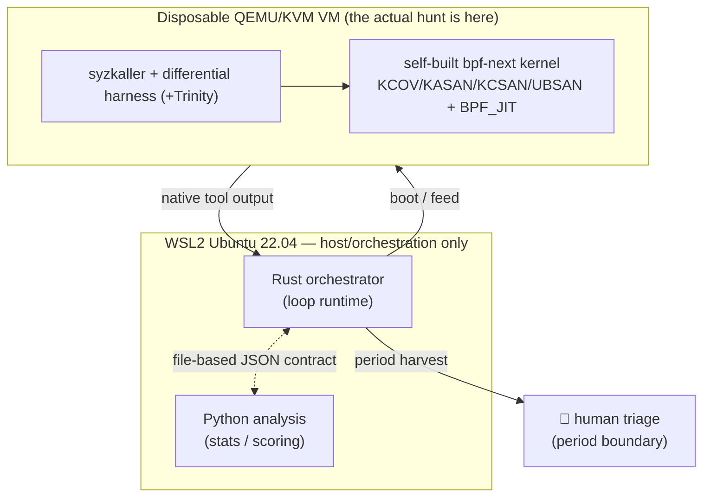

# eBPF Verifier Logic Bug Hunt — Architecture and Engineering Principles

> [!abstract] In one sentence
> A self-closing **operational laboratory loop** that hunts for **logic bug**,
> **temporal-logic bug**, and **corruption-to-primitive** research leads in the
> [[eBPF Verifier|eBPF verifier]] of the `bpf-next` kernel — *not a formal proof
> system*. "Ground truth" = documentation + patch diffs + classical logical
> analysis. A human is inside the loop at every period boundary.

> [!warning] This is NOT a proof system
> No theorem prover, no formal verification, no effort by the loop to prove its own
> soundness/consistency. The measure of correctness is **the difference between an
> observation and the documented/expected behavior** — not a guarantee provided by a
> mathematical model. This distinction is the backbone of the whole architecture;
> every design decision is filtered against it.

---

## 1. Research objective

The Linux kernel's **eBPF verifier** is an abstract interpreter that statically
analyzes BPF programs coming from user space before they are loaded into the kernel.
Once a program earns the "safe" stamp it runs in kernel context — so a **logic error
in the verifier is directly a kernel security vulnerability**.

The three classes hunted:

| Class | What it means | Why in the verifier |
| --- | --- | --- |
| **Logic bug** | The verifier's abstract state (range/tnum) diverges from the actual runtime value → false "accept" | Range tracking, [[tnum]] arithmetic, helper contracts |
| **Temporal-logic bug** | An error dependent on the order/history of state transitions; not in a single instruction but in the path/state evolution | State pruning, backtracking, path exploration |
| **Corruption-to-primitive** | The convertibility of a verification gap into a read/write primitive (research lead) | OOB, pointer arithmetic, spill/fill |

> [!info] Why "logic" — not memory-safety fuzzing
> Classic kernel fuzzing mostly chases crashes (KASAN/panic). The real target here is
> **silent logic drift**: states that the verifier *accepts but that are wrong*.
> These produce no crash; they are caught only by the **observation ≠ documented
> behavior** diff. Memory-safety sanitizers (below) stand as a secondary net.

---

## 2. Ground truth — 4 sources (not a formal model)

The diff engine compares observed kernel behavior against four sources. Each will
have a loader/adapter under `pipeline::groundtruth`:

1. **`verifier.c` state-transition logic** — accept/reject + register-state evolution.
2. **`Documentation/bpf/verifier.rst`** — documented behavior.
3. **Helper `bpf_func_proto` / `arg_type` contracts** — the argument type contract of each helper.
4. **Cross-version patch diffs** — `git log` (across kernel versions); historical
   evidence of when/why a behavior changed.

> [!tip] "Documented-vs-observed" is the heart of the loop
> Anomaly scoring *ranks* interesting records; but the actual claim (**"this behavior
> diverges from what is documented"**) comes from the diff made against these four
> sources. The `diff` stage is **built**: the external-source loaders
> (verifier.c/rst/patch) are TODO because they require a kernel tree, but the
> **intrinsic logical invariants** (tnum well-formedness, bound ordering, tnum↔bounds
> consistency, JIT↔interp equivalence — the "classical logical analysis" column)
> already produce real findings without any external file. `diff` **detects**, score
> **ranks** (findings carry no severity; guardrail).

---

## 3. Execution architecture (where it runs)



- **Host / orchestration:** WSL2 Ubuntu 22.04 on Windows 11 (KVM on, nested virt
  on). This layer is **only** orchestration — the actual hunt does not run here.
- **Execution:** [[QEMU-KVM]] **disposable VM**s run **self-built `bpf-next`
  kernels**. The VM is single-use; that is why data is *harvested* to the host (see
  §7, "copy, don't reference").
- **TCG fallback:** the pure-software path without KVM (slow) — only for **manual PoC
  / differential**, not for real throughput. It kicks in when `/dev/kvm` is absent.

---

## 4. Fuzzing stack & kernel config

- **Primary:** [[syzkaller]] (requires Go) — coverage-guided kernel fuzzer.
- **Differential harness:** runs a verifier-accepted program for **interpreter vs
  [[BPF JIT|JIT]]** retval + `data_out` difference (JIT↔interp drift = a strong
  hard-signal).
- **Optional:** Trinity (syscall fuzzer).
- **Kernel `.config`** enables: [[KCOV]] (coverage feedback), [[KASAN]]
  (memory-safety), KCSAN (data-race), UBSAN (undefined behavior), `BPF_JIT`,
  `BPF_JIT_ALWAYS_ON`, `DEBUG_INFO_BTF` (+ BTF/pahole preconditions).
  → `config/kernel/bpf-verifier-lab.config`.

> [!note] Which tool produces which CORE field (data-source map)
> This distinction is critical: **syzkaller alone does NOT PRODUCE the verifier's
> accept/reject + register-state output** — that data lives in the kernel's verifier
> **log buffer** (`BPF_PROG_LOAD .log_level=2`) and in dmesg. Confirmed: the default
> output of a 200-second campaign is only `manager log + corpus.db (+ crashes/)`.
>
> | CORE field | Actual source | Producer |
> | --- | --- | --- |
> | verifier decision + reason | `BPF_PROG_LOAD` retval + log_buf | **differential harness** (dmesg fallback) |
> | register-state evolution (tnum/bounds/reg type) | verifier log buffer @ `log_level=2` | **differential harness** |
> | `insn_processed` / processed states | verifier log/stats | **differential harness** |
> | JIT↔interp retval + `data_out` | `BPF_PROG_TEST_RUN`, **two kernels** (JIT vs interpreter) | differential harness — **deferred**, see ⚠️ |
> | coverage delta (new BB) + exec N | KCOV | **syzkaller** |
> | helper `arg_type` violation | call-site reg types (log buffer) ⋈ proto | **diff** stage (source: harness log) |
>
> Conclusion: syzkaller's job is **coverage-guided input generation + surfacing
> crashes**; the primary producer of the verifier-semantic CORE fields is the
> **differential harness**. That is why the "real per-tool parser" in §5 is not one
> but split into **two** parsers: (a) the syzkaller coverage/crash parser, (b) the
> differential-harness verifier-log parser — verifier logic bugs surface mainly in
> (b).
>
> ⚠️ **The JIT↔interp differential CANNOT BE DONE on a single kernel.** The primary
> kernel is built with `CONFIG_BPF_JIT_ALWAYS_ON=y` → the interpreter is out of the
> build, `bpf_jit_enable` is pinned to 1. This signal requires **a separate
> interpreter-only kernel** (`ALWAYS_ON` off, `bpf_jit_enable=0`) + a cross-kernel
> run; deferred to a later harness mode. Harness v0 produces **decision +
> register-state** (see `harness/`, devlog 0011).

---

## 5. The loop (pipeline)

```
fuzzer/recon output
  → ingest      (collect raw output WITHOUT MODIFYING it)
  → normalize   (interpret into the schema of the 4 metric groups)
  → score       (Python, anomaly scoring — RANKS for human triage)
  → diff        (documented-vs-observed; intrinsic invariant + oracle)  ✅ (external loader TODO)
  → report      (score ⋈ diff; triaged PERIOD_REPORT batch)            ✅
  → 👤 human-in-the-loop → feeds back into the next period
```

Each stage is a separate module in the `pipeline` crate; typed input/output. Current
status:

| Stage | Status | Note |
| --- | --- | --- |
| `ingest` | ✅ | collect byte-for-byte, write `RAW_INDEX` |
| `normalize` | ✅ | interpret into the frozen schema; **golden fixture + `ReferenceParser`** anchor present (parser-layer guardrail); real per-tool parsers (syz + harness) TODO |
| `score` | ✅ | Rust→Python subprocess; `baseline-hard-signals-v0`; statistics TODO |
| `diff` | ✅ | intrinsic logical invariant + injected `GroundTruth` oracle; external-source loader TODO |
| `report` | ✅ | `ANOMALY_SCORES` ⋈ `DIFF_FINDINGS` → triaged `PERIOD_REPORT`; ordered by score, no new severity |

> [!success] The pipeline runs end to end
> All five stages (`ingest → normalize → score → diff → report`) run in full — from a
> mock fuzzer all the way to the triaged batch handed to a human. The remaining work
> is **not code, but integration**: real native-format parsers, a real `FuzzDriver`/VM
> ([[QEMU-KVM]] + [[syzkaller]]), and the external ground-truth loaders
> (verifier.c/rst/patch, once the [[bpf-next]] tree is available).

---

## 6. Period model — **N = exec count, NOT time**

> [!important] A period = total fuzzing exec count (a counter)
> A **period** is the interval over which the loop grows and delivers a **triaged
> data batch** to a human. The boundary is the **cumulative exec count** N, 2N, 3N… —
> **not a fixed duration.** Wall-clock time is only a **timestamp/label** stamped onto
> the data; **never a stopping criterion.** A secondary **efficiency observation** (new
> coverage / new state per exec) is kept *for reporting only* — not a decision
> criterion.

The reason: time-based periods depend on hardware speed/noise and are not comparable;
exec-based periods give a **deterministic and machine-independent unit of work**.

---

## 7. The four metric groups

Separate schema modules in the `metrics` crate (+ a mirror in
`python/.../schemas/`). The schema is **frozen** (serde). The CORE "full +
register-state evolution" variant.

1. **CORE** — fixed, pure operational observation, tied to ground truth, **always
   on**, **independent of the counterfactual layer**, meaningful on its own.
   Contains:
   - Verifier decision (accept / reject + reason).
   - **Register-state evolution**: a per-insn snapshot; for each reg the [[tnum]]
     `value`/`mask`, `umin`/`umax`/`smin`/`smax`, reg type.
   - `insn_processed` / processed states.
   - **JIT↔interpreter** retval + `data_out` difference.
   - Coverage delta (KCOV, new BB per exec) + the exec counter N.
   - Helper `arg_type` contract-violation signal.
2. **DERIVED** — the schema is fixed; values fill in as the loop grows (e.g.
   `efficiency_per_exec` — **REPORT-ONLY**).
3. **COUNTERFACTUAL** — extra / **opt-in**; sits **ON TOP** of core, never modifies
   it. Deliberately kept **outside** core so that the engine reads the raw
   observation, not the alternatives the loop itself produces.
4. **"Did the loop expect this?" flag** — a separate field to **measure**
   confirmation bias (NoPrediction / Expected / Unexpected).

> [!note] Why verbatim `String` (not an enum)
> `reg_type` and the reject `reason` are stored as raw `String`. Across kernel
> versions these labels shift (drift); locking them into an enum corrupts the raw
> observation. This is the schema-level reflection of the **keep the raw data
> sacred** principle.

---

## 8. Confirmation-bias guardrail (HARD) — the morality of the architecture

> [!danger] Not a solved problem, a live stress point
> The loop's obligation to produce counterfactual output must not turn it into a
> *counterfactual-optimizing* process that **generates input to confirm its own
> expectation** — i.e. into a **confirmation-biased fuzzer**. **Every change** on the
> scoring / counterfactual / input-selection path must be audited against this. (The
> full text is embedded as a comment inside
> `crates/orchestrator/src/loop_runtime.rs` — it must stay there.)

Three protections:

1. **CORE is independent of the counterfactual layer** — the engine reads the raw
   observation, not the alternatives the loop produces.
2. **The "expected?" flag** — bias is **not hidden, it is measured**.
3. **Human-in-the-loop at every period boundary** — the final filter is a human.

The concrete invariant: **scores RANK for human triage; they NEVER feed the fuzzer's
input selection** (written in `scoring.py` + `score.rs`). If a score were a signal
that automatically opened the feedback gate, the loop would start hunting what it
expected.

---

## 9. Language boundary — Rust ⟷ Python (file-based JSON contract)

The two languages meet at a **clean and documented boundary**:

- **Rust** — architecture, orchestration, services, loop runtime, VM control.
- **Python** — statistics, data processing, metric analysis, anomaly scoring.

The meeting point is a **typed, file-based JSON artifact contract**: the Rust
orchestrator writes normalized-metric artifacts into a period directory, calls the
Python analyzer, and reads the scores back — **no shared process memory**. The
contract is defined in the `contract` crate, mirrored in `python/.../contract.py`;
the two are **lockstep**.

> [!example] Why a file, not process memory
> It maps one-to-one onto the "periodic harvest" model: disposable VM → file to host,
> host → file to Python. The artifacts are auditable, replayable, language-independent,
> and leave durable evidence in the period directory. Envelope: `Artifact<T>` = `{
> contract_version, period_id, producer, payload }`, written atomically,
> version-checked on read.

---

## 10. Engineering principles (portable lessons)

Decisions not specific to this loop, portable to other research infrastructures:

- [ ] **Collect raw output without modifying it; normalization is separate, a later
  stage.** Never interpret at the source. (`ingest` copies byte-for-byte; `normalize`
  interprets.) Early interpretation = irreversible information loss + a confirmation-
  bias leak.
- [ ] **Frozen contract ≠ replaceable logic — manage the distinction deliberately.**
  If it is a frozen contract (envelope, CORE schema) **ask the user**; if it is
  replaceable logic (the scoring method) proceed with a reasonable baseline and leave
  a `TODO`.
- [ ] **Injectable abstraction + mock/reference implementation.** `FuzzDriver`/
  `MockDriver`, `RecordParser`/`UnimplementedParser`, `Analyzer`/`PythonAnalyzer`.
  This lets the control flow be tested **without a real fuzzer/VM/Python**; the real
  implementation is "swap-in".
- [ ] **Evidence > claim.** For each stage a real e2e proof (cross-language
  round-trip, `diff = IDENTICAL`, a real subprocess) — saying "it works" is not
  enough, it is shown.
- [ ] **Atomic file writes** (tmp sibling + `rename`/`os.replace`) — a reader never
  sees a half file.
- [ ] **Deterministic & offline.** Dependencies are built offline from a cache;
  choices like the fingerprint (FNV-1a-64) and mtime-int stay deterministic **without
  adding a date/crypto dependency**.
- [ ] **Let the unit be a natural unit of work** (exec count), not wall-clock —
  machine-independent, comparable.
- [ ] **Keep the human-in-the-loop boundaries explicit.** Automation *ranks* triage;
  the human decides. A critical/irreversible gate is never opened by a score.
- [ ] **Ask about every unspecified design decision, or leave it as a `TODO`** — no
  ad hoc decision-making. (A standing instruction; see §8, consistent with the
  guardrail philosophy.)
- [ ] **Devlog discipline** — what/why/which decision, with evidence not claims. See
  `docs/devlog/devlog.md`.

---

## 11. Related notes & references

- Project devlog: `docs/devlog/devlog.md` (0001–0005).
- Sources: `verifier.c`, `Documentation/bpf/verifier.rst`, `bpf_func_proto`/`arg_type`,
  [[bpf-next]] git history.
- Concepts: [[eBPF Verifier]] · [[tnum]] · [[syzkaller]] · [[KCOV]] · [[KASAN]] ·
  [[QEMU-KVM]] · [[BPF JIT]] · [[Confirmation Bias]]

> [!quote] One-line compass
> **Observation ≠ documented behavior** — the entire purpose of the loop is to collect
> that difference without bias and present it to a human in ranked form.
